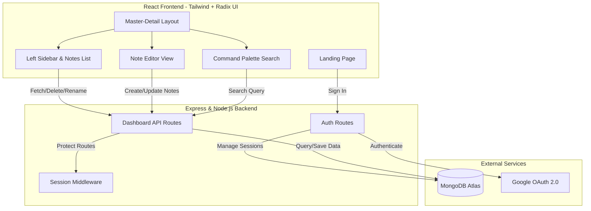

<h1 align="center">Welcome to Noteracy 👋</h1>
<p align="center">
  A seamless, distraction-free workspace for capturing and organizing your thoughts.
</p>

### Overview

Noteracy is a modern note-taking application designed for speed and simplicity. Built with a responsive Master-Detail architecture, it allows you to:

- **Create & Edit:** Write notes instantly with a clean, unstyled editor.
- **Global Search:** Find any note in milliseconds using the built-in Command Palette (Cmd+K).
- **Manage Securely:** Authenticate seamlessly via Google OAuth to keep your data private.

---

## Tech Stack

- **Frontend:** React.js, Tailwind CSS v3, Radix UI Primitives, `cmdk`
- **Backend:** Node.js, Express.js, Passport.js (Google OAuth 2.0)
- **Database:** MongoDB (Mongoose)

## Architecture



**Design Principles:**
- **Centralized Tokens:** All design tokens (colors, fonts, spacing) are managed in `client/src/styles/tokens.css`.
- **Accessible Primitives:** Interactivity relies on Radix UI components, ensuring ARIA compliance and keyboard navigation.

---

## Local Development

### 1. Install Dependencies
```sh
npm install
cd client && npm install
```

### 2. Environment Variables
Copy `.env.example` to `.env` in the root directory:
```sh
cp .env.example .env
```
Ensure the following variables are set:
```env
PORT=3175
MONGODB_URI=mongodb://localhost:27017/noteracy
BASE_PATH=/notes
GOOGLE_CLIENT_ID=your_google_client_id
GOOGLE_CLIENT_SECRET=your_google_client_secret
GOOGLE_CALLBACK_URL=http://localhost:3175/notes/google/callback
CLIENT_URL=http://localhost:3000/notes
SESSION_SECRET=your_secure_session_secret
```

The dev client also wants `client/.env.development`:
```env
REACT_APP_API_BASE_URL=http://localhost:3175
```
It exists so the "Sign in with Google" link works in development: that link is a
top-level navigation, and CRA's dev proxy deliberately ignores those, so the
browser has to be given the Express server's address outright. In production the
variable is unset and every URL is same-origin.

### 3. Run the App
Start both the backend server and React frontend concurrently (in separate terminals):

**Backend:**
```sh
npm run dev
```

**Frontend:**
```sh
cd client && npm start
```
The dev server mounts the app at http://localhost:3000/notes — see below.

---

## Mount path

Noteracy does not live at a domain root. It is reached as
`https://<short-domain>/notes/…` through a Cloudflare worker that proxies
requests **without rewriting the path**, so the app itself has to answer on
`/notes/…`. Two settings define that prefix and they must agree:

| Where | Setting | Effect |
|---|---|---|
| `.env` (server) | `BASE_PATH=/notes` | routers, static files, session cookie path, OAuth redirects |
| `client/package.json` | `"homepage": "/notes"` | every built asset URL, and `PUBLIC_URL` → the router basename |

Everything else derives from those. On the server, `config/basePath.js`
normalises the value and both `server.js` and `routes/auth.js` read it. On the
client, `src/helper.js` exposes `BASE_PATH` and `apiUrl()` — call `apiUrl()`
for anything the server owns rather than writing `fetch('/api/v1/…')`, which
would resolve against the domain root and land on a neighbouring project.

Three consequences worth knowing:

- **The session cookie is scoped to `/notes`.** Sibling projects on the same
  short domain have no business receiving it.
- **`app.set('trust proxy', 1)`** is required: Render terminates TLS and
  Cloudflare adds a hop, so without it `express-session` refuses to set a
  `Secure` cookie and the rate limiter buckets every visitor together.
- **The Google callback URL is a real public URL.** `GOOGLE_CALLBACK_URL` must
  be `https://<short-domain>/notes/google/callback`, and that exact string has
  to be listed under *Authorized redirect URIs* in the Google Cloud console —
  Google matches it literally, prefix included.

## Deployment
This project is configured for seamless deployment on platforms like **Render**. The `npm run build` script at the root handles installing client dependencies and compiling the React application automatically.

Environment variables to set on the Render service:

```
NODE_ENV            = production
BASE_PATH           = /notes
MONGODB_URI         = <atlas connection string>
SESSION_SECRET      = <random secret>
GOOGLE_CLIENT_ID    = <from Google Cloud console>
GOOGLE_CLIENT_SECRET= <from Google Cloud console>
GOOGLE_CALLBACK_URL = https://<short-domain>/notes/google/callback
CLIENT_URL          = https://<short-domain>/notes
```

Render's own URL (`…onrender.com`) stays the origin the Cloudflare worker
proxies to; a visit to its root redirects to `/notes/`, so you can open
`…onrender.com/notes/` to test the app without going through the worker.

---
*If this project helped you, please give it a ⭐️!*