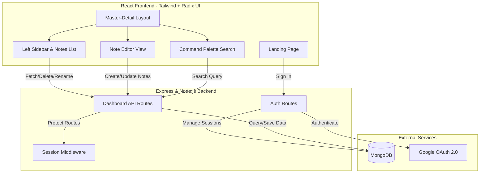

<h1 align="center">Welcome to Noteracy 👋</h1>
<p align="center">
  A seamless, distraction-free workspace for capturing and organizing your thoughts.
</p>

### Overview

Noteracy is a modern note-taking application designed for speed and simplicity. Built with a responsive Master-Detail architecture, it allows you to:

- **Create & Edit:** Write notes instantly with a clean, unstyled editor.
- **Global Search:** Find any note in milliseconds using the built-in Command Palette (Cmd+K).
- **Manage Securely:** Authenticate seamlessly via Google OAuth to keep your data private.

---

## Tech Stack

- **Frontend:** React.js, Tailwind CSS v3, Radix UI Primitives, `cmdk`
- **Backend:** Node.js, Express.js, Passport.js (Google OAuth 2.0)
- **Database:** MongoDB (Mongoose)

## Architecture



**Design Principles:**
- **Centralized Tokens:** All design tokens (colors, fonts, spacing) are managed in `client/src/styles/tokens.css`.
- **Accessible Primitives:** Interactivity relies on Radix UI components, ensuring ARIA compliance and keyboard navigation.

---

## Local Development

### 1. Install Dependencies
```sh
npm install
cd client && npm install
```

### 2. Environment Variables
```sh
cp .env.example .env
```
```env
PORT=3175
MONGODB_URI=mongodb://localhost:27017/noteracy
BASE_PATH=/notes
SESSION_SECRET=your_secure_session_secret
GOOGLE_CLIENT_ID=your_google_client_id
GOOGLE_CLIENT_SECRET=your_google_client_secret
GOOGLE_CALLBACK_URL=http://localhost:3175/notes/google/callback
CLIENT_URL=http://localhost:3000/notes
```

The dev client also needs `client/.env.development`, so the "Sign in with
Google" link reaches the Express server directly:
```env
REACT_APP_API_BASE_URL=http://localhost:3175
```

### 3. Run the App
Two terminals:

**Backend:**
```sh
npm run dev
```

**Frontend:**
```sh
cd client && npm start
```

The app is served at http://localhost:3000/notes.

---

## Deployment

See [`deploy/README.md`](deploy/README.md).

---
*If this project helped you, please give it a ⭐️!*
